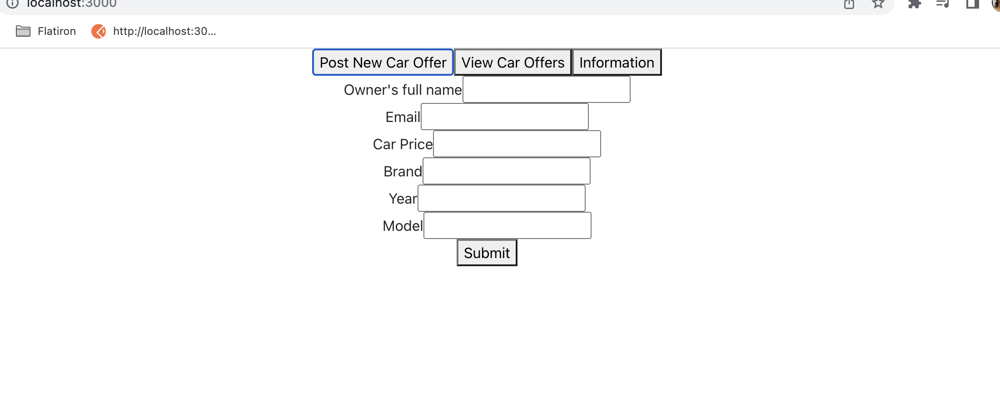

# second-project-flatiron

## Steps to start the application

### you need to install

#### NPM

#### Node.js

### Start the app

#### npm install

#### npm run server

#### npm start

#### Open localhost 3000

#### The application should look like this:


#### on the above image, you can see a list of three car offers which are coming from the db.json file. on the next image, we will find the contact information such as github, and Linkedin links


#### so when we click on an offer, it will open a new window that includes more detailed information about the car offers



#### we can use the above route to create a new car offer by filling up the form.


### initially

#### the db.json file will contain

```json
{
  "cars": [
    {
      "name": "asma sadiq",
      "email": "123@123.com",
      "price": "13000",
      "brand": "honda",
      "year": "2015",
      "model": "civic",
      "id": 3
    },
    {
      "name": "jupiter",
      "email": "123@123.com",
      "price": "25000",
      "brand": "Toyota",
      "year": "2010",
      "model": "camry",
      "id": 4
    },
    {
      "name": "Jupiter",
      "email": "123@123.com",
      "price": "12000",
      "brand": "honda",
      "year": "2017",
      "model": "civic",
      "id": 5
    }
  ]
}
```

### notes

#### this application shows how to use React with combination of react router
