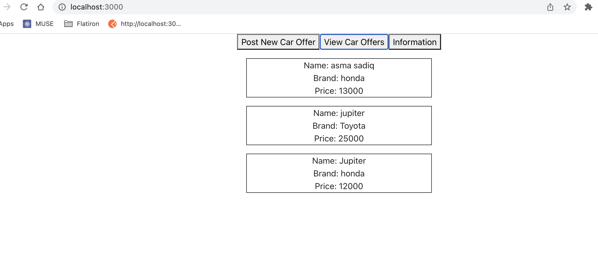
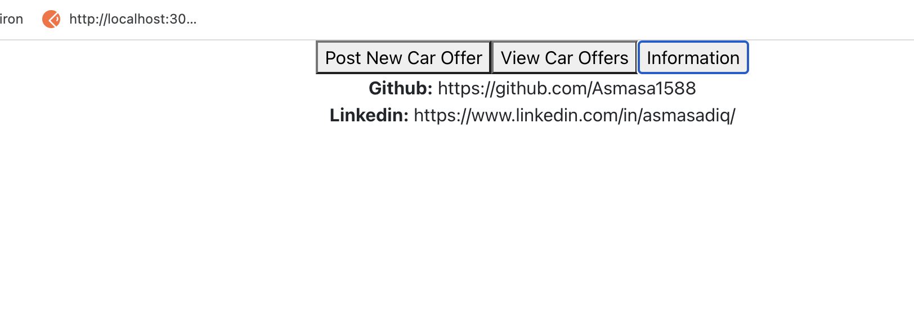
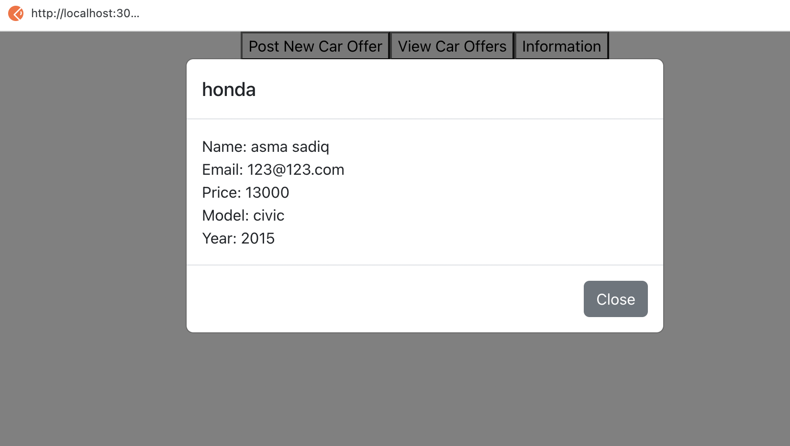

# second-project-flatiron

## Steps to start the application

### you need to install

#### NPM

#### Node.js

### Start the app

#### npm install

#### npm run server

#### npm start

#### Open index.html file

#### The application should look like this:

#### On this page , we will find the contact information such as github, and Linkedin links

#### so when we click on an offer, it will open a new window that includes more detailed information about the car offers

